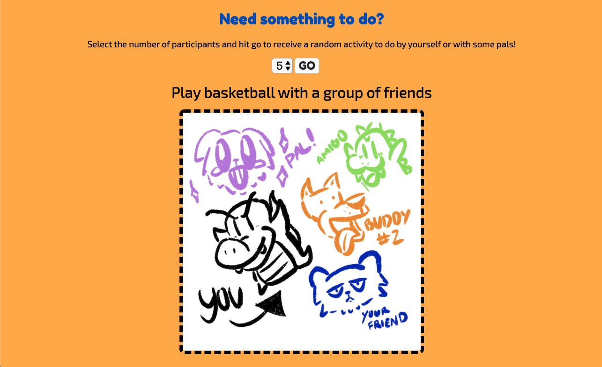

# Simple API: Need Something to do? 
#### Project Scope: Bored? Enter the number of participants and receive a task to do by yourself or with some friends using the bored API!
#### View here: https://svdev-bored.netlify.com

# How it was made:
#### HTML5, CSS3, Javascript E6, API, JSON

# Optimizations:
#### The drop down input feeds a value into the API address in the fetch and displays a new image in the DOM depending on how many participants are selected.

# Lesson Learned: 
#### To successfully fetch the data from the API, I wrote a template literal in the API address with the assigned value of the input. 
