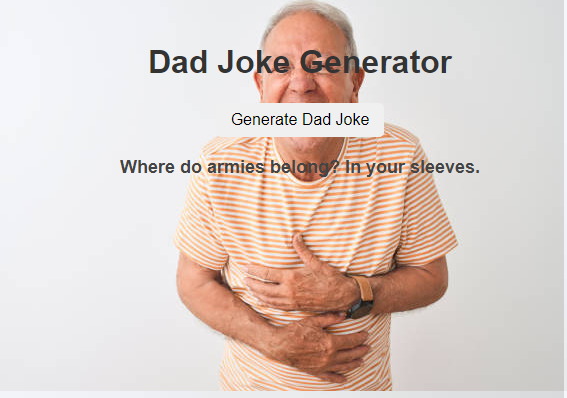

# 📊 Project: Simple API 1

### Goal: Display data returned from an api

### Goal: Connect an API & allow the user to input or recieve data from API

This project is was like setting a light bulb in my head i started to think of all the possiblities with API's & hopefully making one of my own!

### How it's Made
Tech used: HTML, CSS, Javascript
I used object orientated programming to create the board so that it would reset check for a win after each turn. This was my first project introducing OOP
### Optimizations

### Lessons Learned
I learned how to grab & manipulate data from an API it was so cool to see how everything was communicating.

## Example

