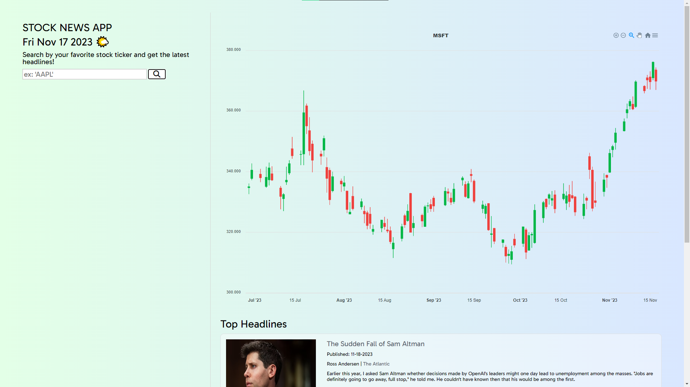

# Stock News and Charts Viewer 📈📰

## Project Description

The Stock News and Charts Viewer project provides users with fast and free access to stock news and charts. By entering a stock ticker (e.g., AAPL or NVDA), users can quickly retrieve the top three headlines related to the stock and view its daily candlestick chart. This application streamlines the process of obtaining relevant stock information without the need to sift through excessive data on traditional news sites.

## How It's Made 🛠️

- **Technologies Used:** HTML, CSS, JavaScript, Fetch API, Alpha Vantage API, Apex Charts for daily chart
- **Project Organization:**
  - Organized project into folders: css (for styles), img (for image files), js (for JavaScript files), and the root folder containing README and index.html.
  - Utilized flexbox for modern and responsive layout.

## Lessons Learned 🧠

- **Formatting Chart Data:**
  - Gained knowledge on formatting chart data for Apex Charts.
  - Explored the use of Apex Charts and options to style and define the type of chart.

- **Dynamic DOM Manipulation:**
  - Learned how to dynamically create and add elements to the DOM.
  - Overcame challenges related to rendering new charts while having an existing chart on the page.

- **Chart Rendering and Destruction:**
  - Faced challenges with rendering new charts while having an existing chart.
  - Discovered the importance of destroying the existing chart before rendering a new one for synchronization.

## Getting Started 🚀

To explore stock news and charts, follow these steps:

1. Clone the repository.
2. Open the `index.html` file in your preferred web browser.
3. Enter a stock ticker and click the 🔎 to view the top three headlines and the daily candlestick chart.

Feel free to contribute, report issues, or provide feedback to enhance the Stock News and Charts Viewer.