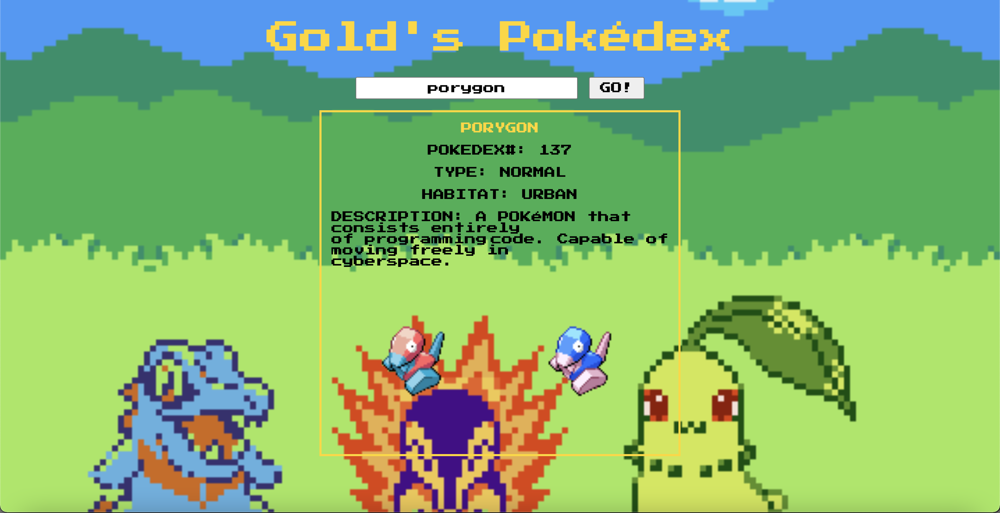

# 🎰 Week08 Bootcamp2021 Project: Simple API 1

### Goal: Display data returned from an api

This is my Simple Pokemon API project that allows users to fetch the name, type, pokedex number, habitat, shiny forms, and pokedex description of any pokemon!

</img>

Link to live site: [https://danielmtran-simplepokemonapi.netlify.app]

### How It's Made:

Tech used: HTML, CSS, JAVASCRIPT

I made the basic styling and layout of the app via HTML and CSS. The main functionality of the app was made using Javascript.

### Optimizations:

### Lessons Learned:

This project helped me further practice on working with APIs