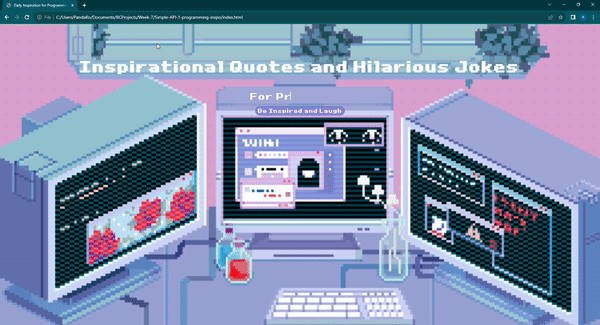

# Inspirational Quotes and Hilarious Jokes For Programmers

A web application that generates a random programming quote and a random programming joke for daily inspiration and laughs. 

Link to project: https://dailyprogrammerinspo.netlify.app/

## How It's Made:

Tech used: HTML, CSS, JavaScript

I used HTML to create the frame of the website. I used CSS to style the webpage and created an typing animation. Then I used JavaScript to create an event listener on the button so that when the user clicks it, it runs the function inspireMe. This function uses fetch with the random programming quote API. The random quote from the api I displayed on the DOM and through JavaScript, I added styling to the section that the quote and joke are nested in when the function was ran. Then I added a second fetch to pull from a random programming joke API. From the second API, I pulled the joke data and the punchline data and displayed it to the DOM with the same styling as the quote section. 

## Lessons Learned:

With this project, I learned how to add styling with JavaScript.