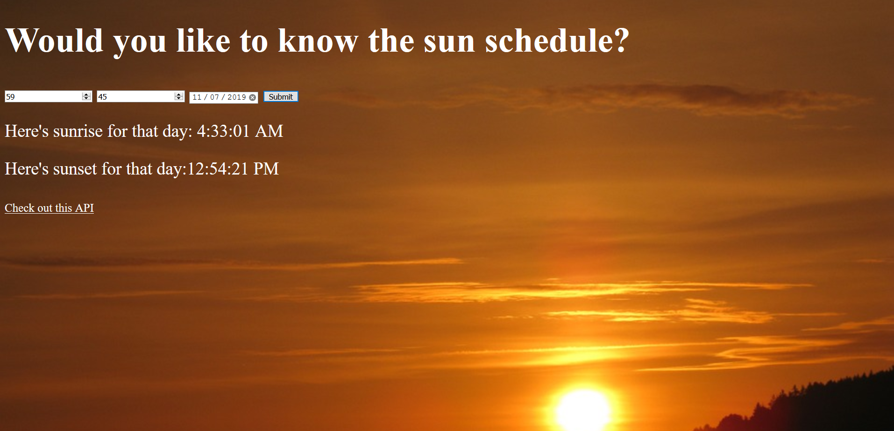

# 📊 Project: Simple API 1
link: https://quizzical-fermi-982ea2.netlify.com/
### Goal: Display data returned from an api

### How I made this:
- Set up three inputs on page, two for location and one for date
- Added a button, if it's pressed, a check would run to make sure all fields were filled
- If they're all filled, an api call is made to gather an object that contains information about sun movments at a particular date
- That info is used to append to the sunrise and sunset trackers on the page
