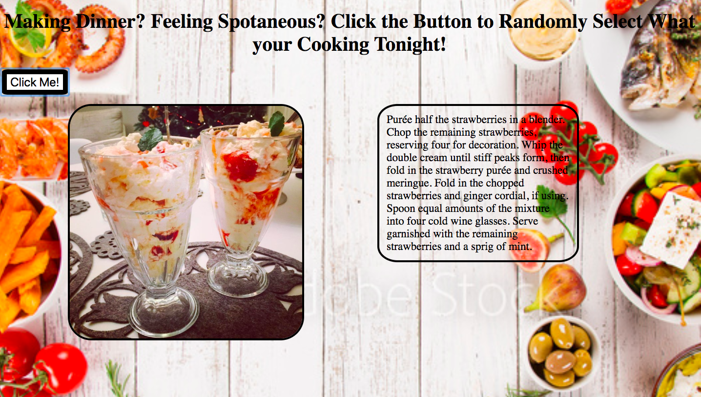

# 📊 Project: Simple API 1

### Goal: Display data returned from an api

# Technology Used:
### HTML, Javascript, Css, API

# Optimizations:
### Click the button and a random meal will be generated with instructions on how to make it.
