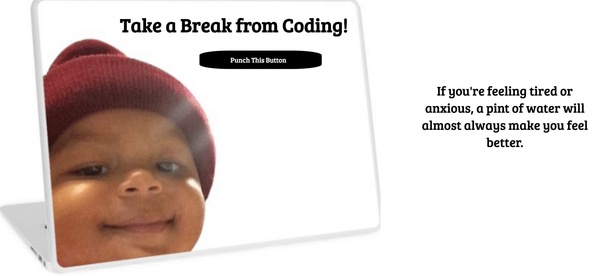

# Advice For Coders
Taking a break from coding is essential after a few hours staring at a screen. When in focus mode one simply doesn't know how to take a break and diffuse without getting distracted especially during reaching a deadline. This work is for the focussed coder.

**Tech used:** HTML, CSS, & JavaScript

