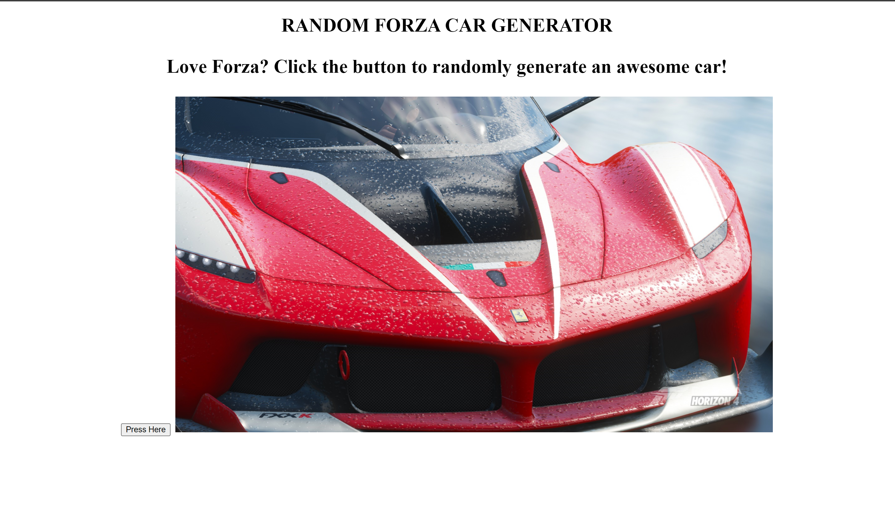

# 📊 Project: Simple API 1

### Goal: Display data returned from an api.

## This project entailed using an API containing data from the popular video game 'Forza.' The user clicks the button and can generate a random image of a vehicle from the video game. 

*Project is completed using HTML, CSS, and Javascript, also with the use of an API.*



<!-- ### How to submit your code for review:

- Fork and clone this repo
- Create a new branch called answer
- Checkout answer branch
- Push to your fork
- Issue a pull request
- Your pull request description should contain the following:
  - (1 to 5 no 3) I completed the challenge
  - (1 to 5 no 3) I feel good about my code
  - Anything specific on which you want feedback!

Example:
```
I completed the challenge: 5
I feel good about my code: 4
I'm not sure if my constructors are setup cleanly...
```
 -->
