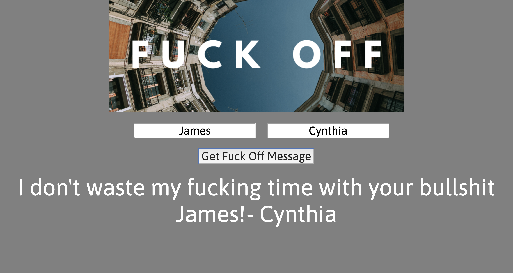

# 📊 Project: Simple API 1

### Goal: Create a web application where users can entere two names and get a message retured back to them using the FOAAS web API. That is then displayed in the DOM 

## Try it out here: https://zealous-jones-e861c8.netlify.com/

Technolgies Used: 
- HTML 
- CSS 
- Javascript 
- foaas api
