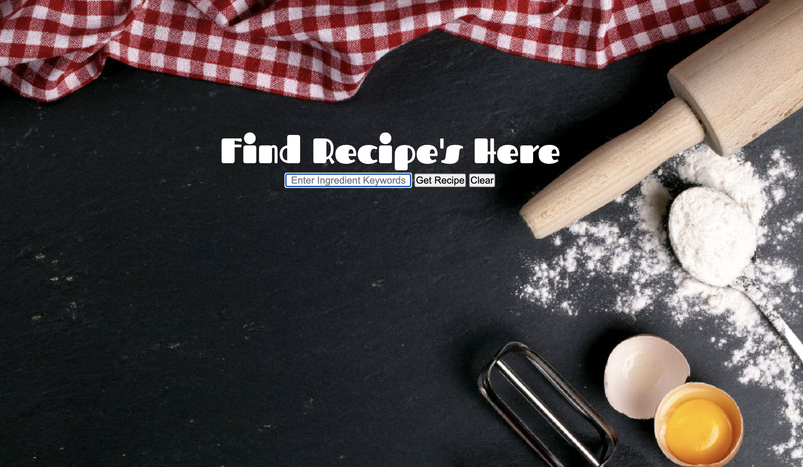

# 📊 Project: Simple API 1

### Goal: Display data returned from an api

### I created a app using an api where you can enter in an ingredient(s) and get back a list of recipes that contain the ingredients you are looking for

[Checkout My Portfolio](https://www.tamikasterlin.com)

