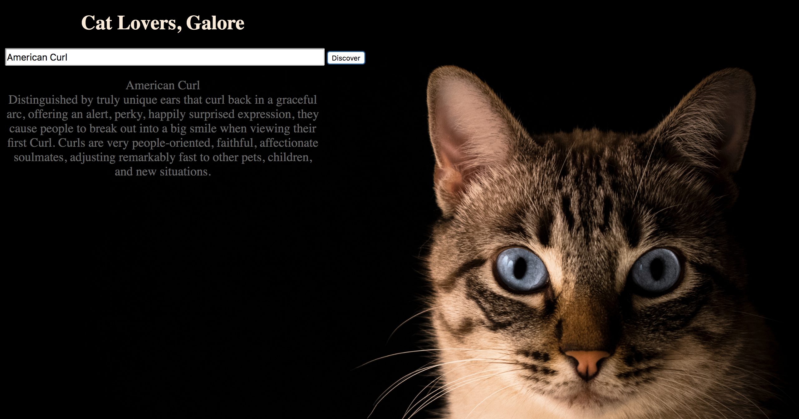

# 📊 Project: Simple API 1

### Goal: Display data returned from an api

* **Project Title: Cat Lovers,Galore**
  - "Cat Lovers,Galore" is a webpage that gives you descriptions of any and all cat breeds.

* **Overview**
  - It pulls data from 'The Cat API'. It receives a concise description of any cat breed's temperament.  
  - This page was created for any and all cat lovers. That includes people that have cats and would like to know more about their cat. Also for those looking to add a cat to their family and cant decide on the breed.

* **link to project**: https://wizardly-babbage-76d413.netlify.com

* **Image of project**

* **Getting Started**
  - Click on the link above
  - Enter the cat breed you would like more information on (ex: exotic shorthair,  persian, main coon, ragoll)
  - click on the "Discover" button to unlock a summary on your desired cat Enjoy! :)
