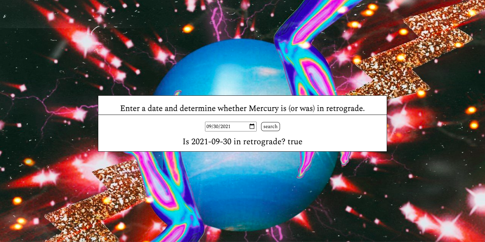

## 🔮 Goal
Enable a user to enter a date - past, present, or future - and see if that date is within a mercury retrograde.

## 🔮 How it's made
Made using HTML, CSS, Javascript, API and JSON. This is also a mobile, tablet, and desktop responsive.

## 🔮 Lesson Learned
This was a really fun one to make. I'm learning that the more I apply these new skills to create sites that interest me, the quicker I get a grasp of the topic. I've been loving this API stuff :-)
