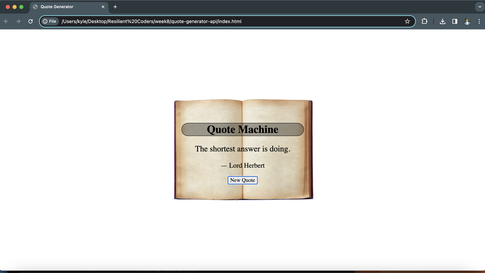

# Quote Generator 🗣️ 

## Overview 

The Quote Generator 📝 is a web application that allows users to generate random quotes by clicking the "New Quote" button. It fetches random quotes from the Forismatic API using JSONP and displays them on the page. The project provides an engaging way to read inspiring and thought-provoking quotes.

## Features

- **Random Quotes:** Click the "New Quote" button to receive a new, random quote.
- **Quote Author:** The app displays the author's name if available.
- **Modern Design:** The app is designed with a clean and responsive layout.

## Technologies Used

- **HTML:** The structure of the web page.
- **CSS:** Styling and layout of the app.
- **JavaScript:** To interact with the Forismatic API and display quotes.
- **Forismatic API:** Provides a source of random quotes.
- **JSONP:** Used to make cross-domain requests to the API.
