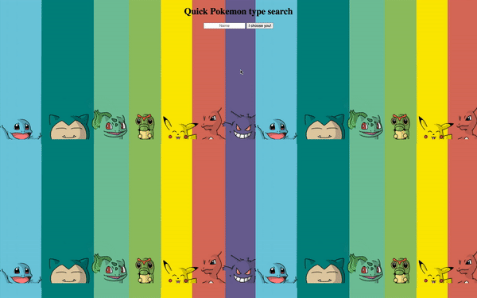

# Quick Pokemon Type Search

Did you get jumped from the tall grass? Elite four bringing you down? Get the type advantage you need with the Pokemon Type Search App!

**Link to project:** https://cydvilla.github.io/simple-api/

## How It's Made:

**Tech used:** HTML, CSS, JavaScript

Utilziing JavaScript, this project makes displays retrieves a sprite and type data from the user's desired input. 
<!-- ## Optimizations
*(optional)*

You don't have to include this section but interviewers *love* that you can not only deliver a final product that looks great but also functions efficiently. Did you write something then refactor it later and the result was 5x faster than the original implementation? Did you cache your assets? Things that you write in this section are **GREAT** to bring up in interviews and you can use this section as reference when studying for technical interviews! -->

## Lessons Learned:

PokeAPI has a lot to it. Chaining the properties required a lot of patience understand how the objects were set up.
