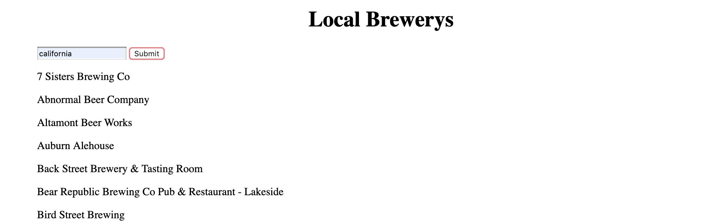

# My Awesome Project
This project gives the user local breweries in their state.

## How It's Made:

**Tech used:** HTML, CSS, JavaScript, Framework of choice

In this project I used a brewery API to get a list of breweries in each state.

## Lessons Learned:

In this project I learned how to list through a list of objects and give them a p element within the HTML.

