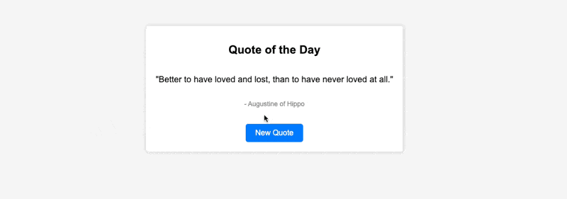

# Quote of the Day

This is a simple web application that displays a random quote of the day. It uses the [Quotable API](https://quotable.io/api) to fetch random quotes and displays them to the user.

## Preview

## Features

- Fetches a random quote of the day.
- Displays the quote text and its author.
- Allows users to load a new random quote.

## Usage

1. Clone this repository to your local machine.
2. Open the `index.html` file in your web browser.
3. Click the "New Quote" button to load a new random quote.

## Technologies Used

- HTML
- CSS
- JavaScript
- [Quotable API](https://quotable.io/api) for fetching quotes

## Development

To run this application locally for development purposes, you can simply open the `index.html` file in a web browser. The JavaScript code in `script.js` fetches random quotes from the Quotable API.

## Author

Jose Diaz

## License

This project is licensed under the MIT License - see the [LICENSE](LICENSE) file for details.
